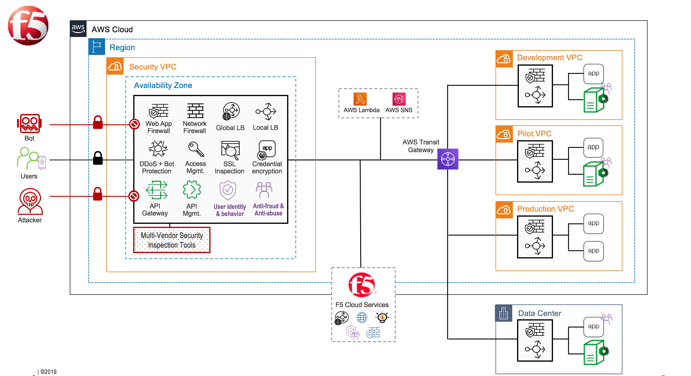
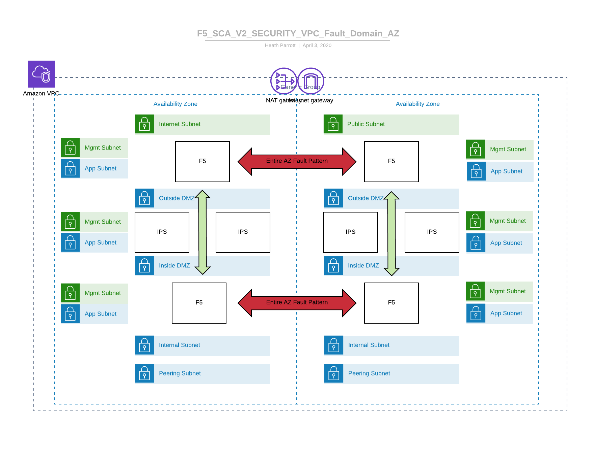
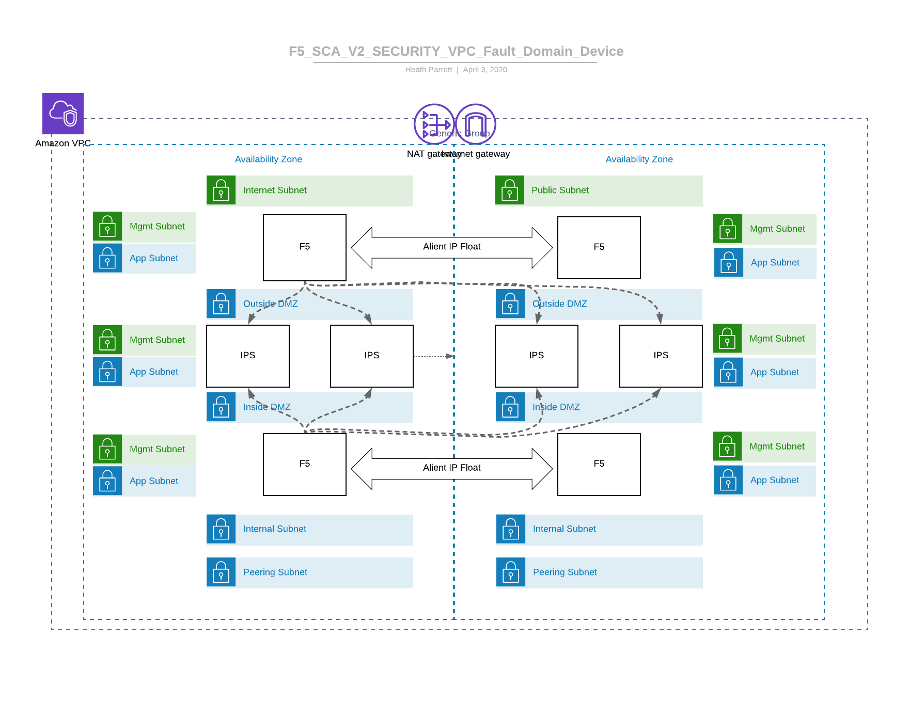

# F5 Terraform AWS Secure Cloud Architecture (SCA)

## Contents

- [CHANGELOG](CHANGELOG.md)
- [What is SCA](#what-is-sca)
- [Prerequisites](#prerequisites)
- [Requirements Mapping](#requirements-mapping)
- [Deploying Custom Configuration to the BIG-IP VE](#deploying-custom-configuration-to-the-big-ip-ve)
- [Post-Deployment Configuration](#post-deployment-configuration)
- [Creating Virtual Servers on the BIG-IP VE](#creating-virtual-servers-on-the-big-ip-ve)
- [Support Guide](#support-guide)
- [Contributing](#contributing)

## What is the Secure Cloud Architecture 

The Secure Cloud Architecture (SCA) is a location & cloud agnostic flexible and repeatable conceptual deployment pattern that can adapt for all customers challenges in the cloud. The SCA pattern is based on several core tenents around business outcomes and desing principles:

- Nearly all organizations will be multicloud (Public AWS/Azure/GCP/OCI/Alibaba/VMC/Other, Private, Hybrid) from an Operational and Technology Stack perspective
- Enterprise wide architectual decisions need to be made to reduce operational complexity while allowing the onboarding of high value aspects of any given cloud environment. 
- Patterns are required to incrase agility and they must be reusable, transferable, automated and iterative. 
- Operations and Security teams need to enable development and business units, while ensuring Governance and Efficency 
- Time to Value across any environment must be reduced
- Support cost optimizations and flexible consumption models (Capex/Opex/Elastic)
- Ruduce risk by minimizing bifurcation of tools and process wherever possible by leveraging reusable tools and processes
- Focus on stability
- A repeatable data path allowing focus on compliance, operational efficency and delivery of applicaiton assets to customers, employees and partners.
- Leverage APIs and Automation 
- Extensible - if/when a given Cloud Service Provider introduces options to simplify the architecture they can be incorperated

Conceptually a Secure Cloud Architeture looks like:

Depending on the cloud provider, fault domains, scale models, IPS systems, or other specific requirments there will be variation in how you can finalize the architecture of your deployment.  Examples of different fault domains and patterns

- Aavailbility Zone Fault Domain

 - Benefits - simplier operations, conceptually easier data path.
 - Drawbacks - 

- Device Level Fault Domain

## AWS Specific Features

The SCA leverages the following in the example archtiecture

- VPC
- Route Tables
- TransitGateway
- VPC Endpoints for EC2 and S3
- S3 Buckets
- EC2 Instances
- Routing via ENI
- IAM Roles
- CloudWatch

The following AWS Technoloiges or Deployment considerations are compatible (not conclusive and will change over time)

- VPC Peering (requries the use of SNAT)
- VPN intereconnecting VPCs
- Ingress Routing
- Deployment of F5 products into another account (recipient account must click subscribe, deploying account must be able to create resources in destination account)
- Global Accelerator
- VPCE for STS

## Prerequisites

- [AWS Subscription](https://console.aws.amazon.com) - with sufficient permissions.
- [Terraform](https://learn.hashicorp.com/terraform/getting-started/install.html)
- Understanding of the AWS SDN components and operations
- Understanding of F5 products in AWS - https://clouddocs.f5.com/cloud/public/v1/aws_index.html and our GitHub repository - https://github.com/F5Networks/f5-aws-cloudformation
- Understanding of F5 BIG-IP modules, virtual servers

## Requirements Mapping

| Category | Title | Description | Mapping | Controls |
|:---:|:---:|:---|:---|:---|
| Security | Traffic Segregation | - The Security Stack shall maintain virtual separation of all management, user, and data traffic. - Components shall provide logically separate network interfaces for access from the management network infrastructure that is logically separate from production. - The Security Stack shall provide secure connectivity to Application management systems that is logically separate from application traffic. - Components shall provide for management traffic segmentation from user and data plane traffic. | LTM / AFM / CORE | SCCA 2.1.2.1, 2.3.2.6, 2.3.2.9, 2.2.3.3 |
| Security | Traffic Encryption | The Security Stack shall allow the use of encryption for segmentation of management traffic. | LTM / Core | SCCA 2.1.2.2 |
| Security | Reverse Proxy | The Security Stack shall provide a reverse proxy capability to handle access requests from client systems. | LTM / Core | SCCA 2.1.2.3 |
| Security | Traffic Filtering | The Security Stack shall provide a capability to inspect and filter application layer conversations based on a predefined set of rules (including HTTP) to identify and block malicious content. | AFM / ASM / PS | SCCA 2.1.2.4 |
| Security | Block Unauthorized | The Security Stack shall provide a capability that can distinguish and block unauthorized application layer traffic. | ASM / AFM| SCCA 2.1.2.5 |
| Security | Traffic Monitor | The Security Stack shall provide a capability that monitors network and system activities to detect and report malicious activities for traffic entering and exiting Application virtual private networks/enclaves. | ASM / AFM / PS| SCCA 2.1.2.6 |
| Security | Block Malicious | The Security Stack shall provide a capability that monitors network and system activities to stop or block detected malicious activity. | ASM / AFM / PS | SCCA 2.1.2.7|
| Security | East / West Inspection | The Security Stack shall inspect and filter traffic traversing between application virtual private networks/enclaves.| AFM | SCCA 2.1.2.8 |
| Security | Break and Inspect Traffic | The Security Stack shall perform break and inspection of SSL/TLS communication traffic supporting single and dual authentication for traffic destined to systems hosted within the Cloud Service Provider.| LTM | SCCA 2.1.2.9 |
| Security | Management Access & Control | The Security Stack shall provide an interface to conduct ports, protocols, and service management activities in order to provide control for operators. | Core / AFM / ASM| 2.1.2.10|
| Security | Logging | The Security Stack shall provide a monitoring capability that captures log files and event data for cybersecurity analysis. | Core | SCCA 2.1.2.11|
| Security | SIEM Integration | The Security Stack shall provide or feed security information and event data to an allocated archiving system for common collection, storage, and access to event logs by privileged users. | Core | SCCA 2.1.2.12|
| Security | FIPS 140-2 | The Security Stack shall provide a FIPS-140-2 compliant encryption key management system for storage of generated and assigned server private encryption key credentials for access and use by the Web Application Firewall (WAF) in the execution of SSL/TLS break and inspection of encrypted communication sessions. | Core | SCCA 2.1.2.13|
| Security | Prevent Session Hijacking | The Security Stack shall provide the capability to detect and identify application session hijacking. | APM / ASM | SCCA 2.1.2.14|
| Security | Provide DMZ | The Security Stack shall provide a DMZ Extension to support Internet Facing Applications. | Core | SCCA 2.1.2.15 |
| Security | Full Packet Capture | The Security Stack shall provide full packet capture or cloud service equivalent capability for recording and interpreting traversing communications. | Core | SCCA 2.1.2.16 |
| Security | Provide Flow Metrics | The Security Stack shall provide network packet flow metrics and statistics for all traversing communications. | Core / AVR | SCCA 2.1.2.17|
| Security | North-South Traffic Inspection | The Security Stack shall provide for the inspection of traffic entering and exiting each Application virtual private network. | AFM | SCCA 2.1.2.18 |
| Security | Management Access | The Security Stack hall allow Priviledged User access to Application management interfaces. | APM / PUA | SCCA 2.2.3.2|
| Scale | Rapid Scale| The Security Stack shall be designed to rapidly scale virtual elements up and down in capacity to achieve negotiated (between components provider and Mission Owner) SLA objectives while minimizing metered billing costs. | Core / AWS | SCCA 2.6.2.1 |
| Scale | Scaling Increments | The Security Stack shall support scalability in increments of 1 Gigabit/second throughput at all points within the design without costly modification. | Core / AWS| SCCA 2.6.2.2 |
| Performance | Throughput | The Security Stack shall start with 1 Gigabit/second throughput and have ability to scale up to 10G.| Core | SCCA 2.4.1.2 |
| Performance | Redundancy | The Security Stack shall meet backbone availability of 99.5%. | Core / AWS | SCCA 2.4.1.5 |
| Performance | Latency | The Security Stack processing latency shall be no greater than 35 milliseconds. | Core / AWS | SCCA 2.4.2.1 |
| Performance | QoS| The Security Stack shall support IP packet forwarding in accordance with tagged QOS prioritization| LTM | SCCA 2.4.2.5 |
| Full Packet Capture | SIEM Integration | The Security Stack shall support integration with SIEM systems to effect data search and retrieval, such as the capability to pull select timeframes of captured data. | Core | SCCA 2.3.5.1 |

## Deploying Custom Configuration to the BIG-IP VE

## Post-Deployment Configuration

### Creating Virtual Servers on the BIG-IP VE

Creating virtual servers is a multistep process that can be accomplished via APIs or direct user interaction.  A virtual server consistens of the following components

1. Virtual Server IP and configuration
2. SDN Assinged secondary IP that = the Virtual Server IP
3. Elastic IP (Public IP) that is mapped to to a virtual server(s)

If a user is deploying an inter-AZ HA model (this template does) a public IP will be mapped/remapped to two different virtual servers since an Avaliblity Zone is also a subnet boundary. For more information on this process please refer to F5's Cloud Failover Extension documentation found here - https://clouddocs.f5.com/products/extensions/f5-cloud-failover/latest/userguide/aws.html 

F5 recomends that customers leverage AS3 for configuration and managment of virtual servers (Step 1 Above). AS 3 will incorperate features faster than imperative API tools such as Ansible or Terraform modules and allows users to move to an as-code model.  For more information on AS 3 please see https://clouddocs.f5.com/products/extensions/f5-appsvcs-extension/latest/.  AS3 can be imbeded into CFT calls, used with Terraform, used with Ansible or pushed via tools such as Postman or CURL. 

For the other configuraiton steps there are many automations tools avalible and your organization should work with the ones that allow you to be the most efficient overall.  The workflow that is accomplished via Terrafrom in this repository could also be accomplished via those tools. 

## Filing issues

If you find an issue, we would love to hear about it. You have a choice when it comes to filing issues:

- Use the [Issues link](https://github.com/f5devcentral/terraform-aws-f5-sca/issues) on the GitHub menu bar in this repository for items such as enhancement or feature requests and non-urgent bug fixes. Tell us as much as you can about what you found and how you found it.

## Support Guide

Although this repository is community-supported, the VE instances deployed from the images generated by this tool are supported by [F5 Support](https://www.f5.com/company/contact/regional-offices#product-support).

To file an issue, report defects, security vulnerabilties, or submit enhancements and general questions open an issue within the GitHub repository.

1. Click [New issue](https://github.com/f5devcentral/terraform-aws-f5-sca/issues/new).
2. Enter a title, a description, and then click **Submit new issue**.

### Known issues

All known issues are now on the GitHub **Issues** tab for better tracking and visibility. Sort the [issues list](https://github.com/f5devcentral/terraform-aws-f5-sca/issues?q=is%3Aopen+is%3Aissue+label%3A"known+issue") by expanding the **Label** column and selecting **Known issue**.

## Contributing

Individuals or business entities who contribute to this project must have completed and submitted the F5 Contributor License Agreement.

### F5 Networks Contributor License Agreement

Before you start contributing to any project sponsored by F5 Networks, Inc. (F5) on GitHub, you will need to sign a Contributor License Agreement (CLA).  

If you are signing as an individual, we recommend that you talk to your employer (if applicable) before signing the CLA since some employment agreements may have restrictions on your contributions to other projects. Otherwise by submitting a CLA you represent that you are legally entitled to grant the licenses recited therein.  

If your employer has rights to intellectual property that you create, such as your contributions, you represent that you have received permission to make contributions on behalf of that employer, that your employer has waived such rights for your contributions, or that your employer has executed a separate CLA with F5.

If you are signing on behalf of a company, you represent that you are legally entitled to grant the license recited therein. You represent further that each employee of the entity that submits contributions is authorized to submit such contributions on behalf of the entity pursuant to the CLA.